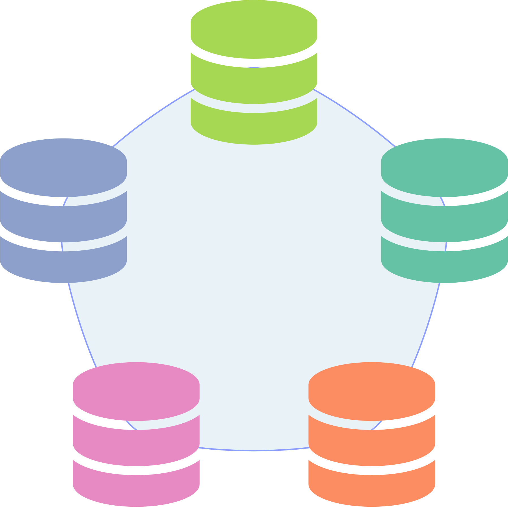

# db-pool

 

[Book](https://yasamoka.github.io/db-pool)

A thread-safe database pool for running database-tied tests in parallel with:
- Easy setup
- Proper isolation
- Automatic creation, reuse, and cleanup
- Async support

### Databases

- MySQL (MariaDB)
- PostgreSQL

### Backends & Pools

#### Sync

| Backend         | Pool                                      | Feature           |
| --------------- | ----------------------------------------- | ----------------- |
| diesel/mysql    | [r2d2](https://docs.rs/r2d2/0.8.10/r2d2/) | `diesel-mysql`    |
| diesel/postgres | [r2d2](https://docs.rs/r2d2/0.8.10/r2d2/) | `diesel-postgres` |
| mysql           | [r2d2](https://docs.rs/r2d2/0.8.10/r2d2/) | `mysql`           |
| postgres        | [r2d2](https://docs.rs/r2d2/0.8.10/r2d2/) | `postgres`        |

#### Async

| Backend               | Pool                                                                                      | Features                                     |
| --------------------- | ----------------------------------------------------------------------------------------- | -------------------------------------------- |
| diesel-async/mysql    | [bb8](https://docs.rs/diesel-async/0.4.1/diesel_async/pooled_connection/bb8/index.html)   | `diesel-async-mysql`, `diesel-async-bb8`     |
| diesel-async/mysql    | [mobc](https://docs.rs/diesel-async/0.4.1/diesel_async/pooled_connection/mobc/index.html) | `diesel-async-mysql`, `diesel-async-mobc`    |
| diesel-async/postgres | [bb8](https://docs.rs/diesel-async/0.4.1/diesel_async/pooled_connection/bb8/index.html)   | `diesel-async-postgres`, `diesel-async-bb8`  |
| diesel-async/postgres | [mobc](https://docs.rs/diesel-async/0.4.1/diesel_async/pooled_connection/mobc/index.html) | `diesel-async-postgres`, `diesel-async-mobc` |
| sea-orm/sqlx-mysql    | [sqlx](https://docs.rs/sqlx/0.7.4/sqlx/struct.Pool.html)                                  | `sea-orm-mysql`                              |
| sea-orm/sqlx-postgres | [sqlx](https://docs.rs/sqlx/0.7.4/sqlx/struct.Pool.html)                                  | `sea-orm-postgres`                           |
| sqlx/mysql            | [sqlx](https://docs.rs/sqlx/0.7.4/sqlx/struct.Pool.html)                                  | `sqlx-mysql`                                 |
| sqlx/postgres         | [sqlx](https://docs.rs/sqlx/0.7.4/sqlx/struct.Pool.html)                                  | `sqlx-postgres`                              |
| tokio-postgres        | [bb8](https://docs.rs/bb8-postgres/0.8.1/bb8_postgres/)                                   | `tokio-postgres`, `tokio-postgres-bb8`       |
| tokio-postgres        | [mobc](https://docs.rs/mobc-postgres/0.8.0/mobc_postgres/)                                | `tokio-postgres`, `tokio-postgres-mobc`      |
